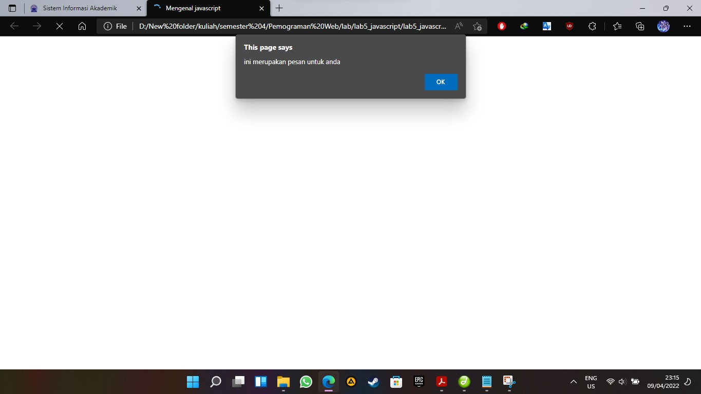
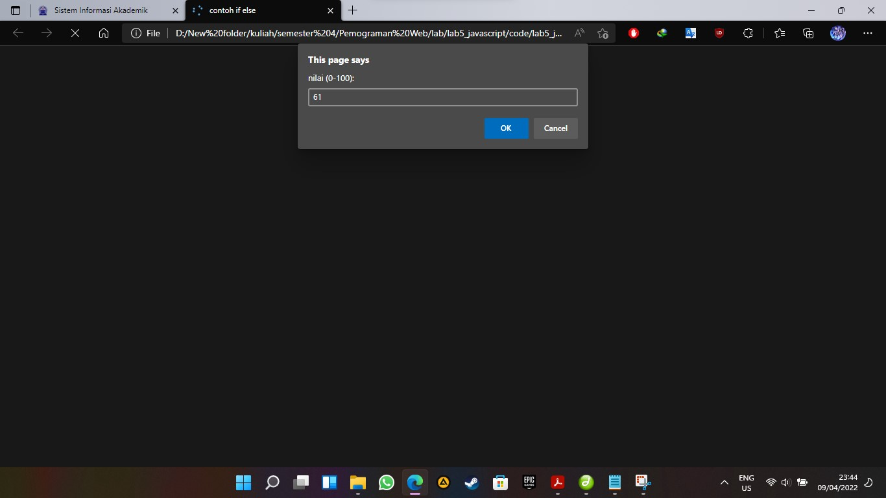
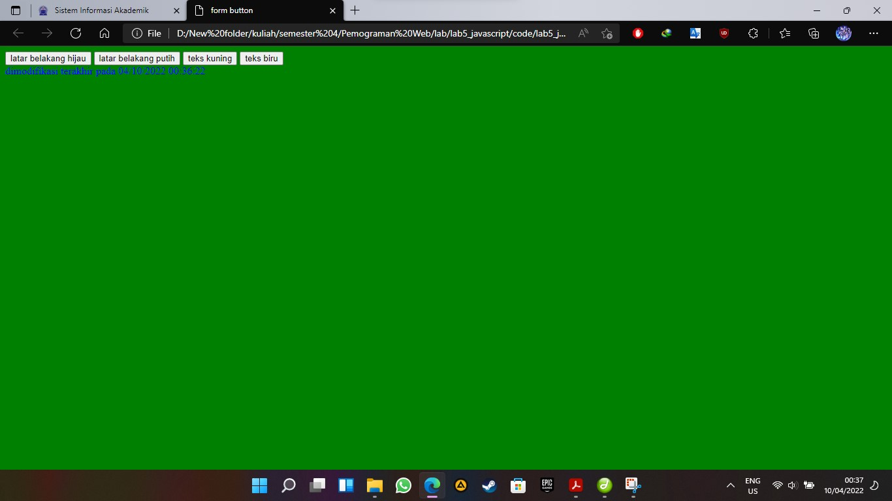

#lab5web
# bagus tri handono - 312010170
# 20.TI.B1
============================================================= 
membuat berbagai macam javascript 
link code untuk membuat javascript dasar windows allert 
link code=>[contoh 1](code/lab5_javascript.html) \
 
 

link code untuk membuat javascript dasar memasukkan promt 
link code=>[contoh 2](code/lab5_javascript1.html) \
 
 

link code untuk membuat javascript dasar pembuatan fungsi dan cara pemanggilannya 
link code=>[contoh 3](code/lab5_javascript2.html) \
 
 \

link code untuk membuat javascript operasi dasar aritmatika 
link code=>[contoh 4](code/lab5_javascript3.html) \
 
 
 

link code untuk membuat javascript seleksi kondisi if else 
link code=>[contoh 5](code/lab5_javascript4.html) \
 
 
 

link code untuk membuat javascript operasi switch 
link code=>[contoh 6](code/lab5_javascript5.html) \
 
 
 

link code untuk membuat javascript membuat form input 
link code=>[contoh 7](code/lab5_javascript6.html) \
 
 

link code untuk membuat javascript form button 
link code=>[contoh 8](code/lab5_javascript7.html) \
 
 
 
 

link code untuk membuat javascript penggunaan checkbox dan hitung otomatis 
link code=>[contoh 9](code/lab5_javascript8.html) \
 
 

tugas 
link code=>[tugas membuat validasi dan isiian form](code/lab5_javascript9.html) \

